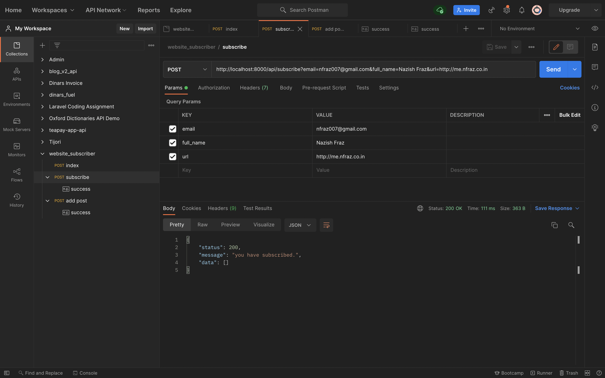
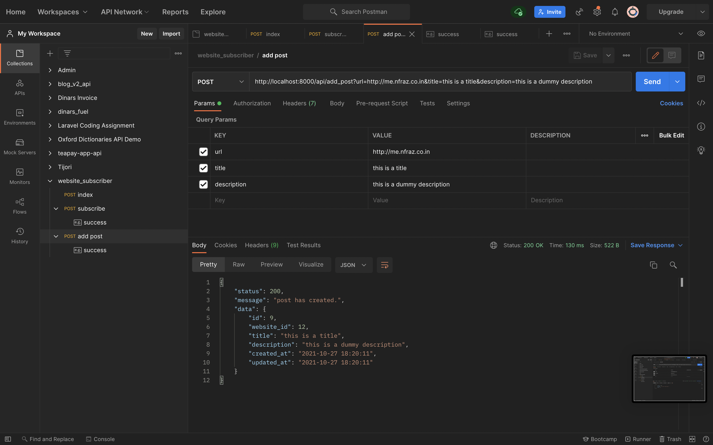
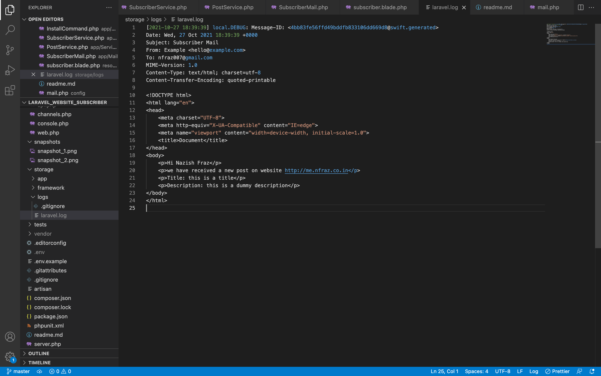

# Website Subscriber

## Problem Statement
Create a simple subscription platform(only RESTful APIs with MySQL) in which users can subscribe to a website (there can be multiple websites in the system). Whenever a new post is published on a particular website, all it's subscribers shall receive an email with the post title and description in it. (no authentication of any kind is required)

MUST:-
- Write migrations for the required tables.
- Endpoint to create a "post" for a "particular website".
- Endpoint to make a user subscribe to a "particular website" with all the tiny validations included in it.
- Use of command to send email to the subscribers.
- Use of queues to schedule sending in background.
- No duplicate stories should get sent to subscribers.
- Deploy the code on a public github repository.

OPTIONAL:-
- Seeded data of the websites.
- Open API documentation (or) Postman collection demonstrating available APIs & their usage.
- Use of latest laravel version.
- Use of contracts & services.
- Use of caching wherever applicable.
- Use of events/listeners.

Note:- 
1. Please provide special instructions(if any) to make to code base run on our local/remote platform.

## Technologies
- Laravel
- Mysql
- XAMPP
- Composer

## Installation
clone the repo
```sh
git clone https://github.com/nfraz007/laravel_website_subscriber.git
cd laravel_website_subscriber
```

copy the environment file
```sh
cp .env.example .env
```

create a new database as website_subscriber and fill the detail in .env file

run composer install
```sh
composer install
```

install the project
```sh
php artisan key:generate
php artisan install
```

run laravel project
```sh
php artisan serve
```

run queue job server
```sh
php artisan queue:work
```

## Postman Collection
[link](postman/website_subscriber.postman_collection.json)

## Snapshot


